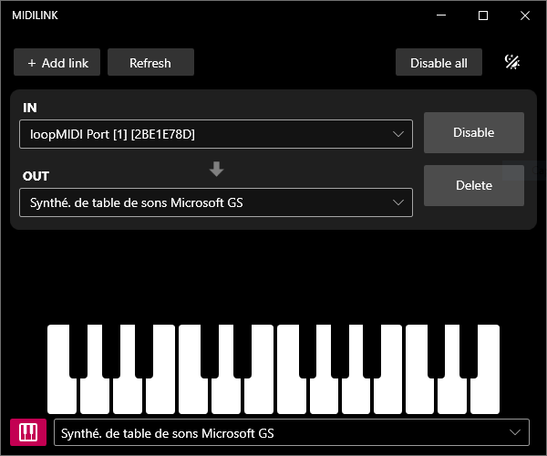

# MidiLink

MidiLink is a Windows 10/11 app for routing MIDI messages between devices, and is compatible with MIDI BLE.

Create a link, choose an IN device and an OUT device, enable the link, and MidiLink will forward any MIDI message from IN to OUT.
You can create as many links as you want.

It can be useful for sending MIDI messages to the Microsoft GS Wavetable Synth, or for using a MIDI BLE device with other MIDI software that does not support BLE if used with loopMIDI or another virtual MIDI driver.

